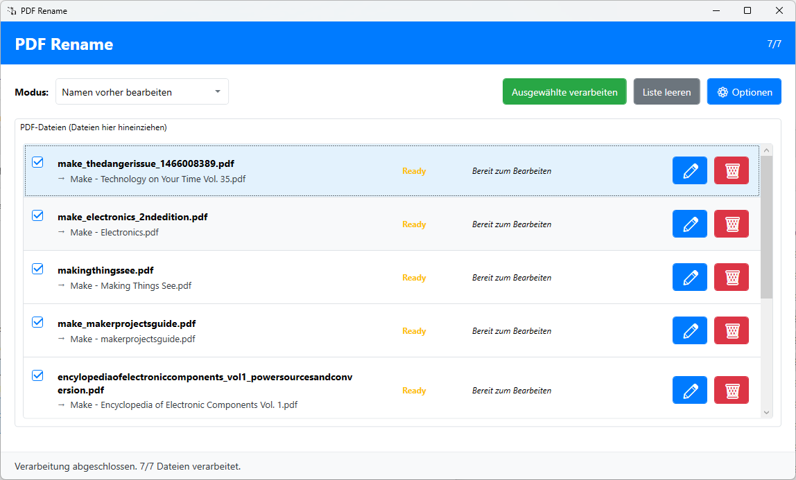
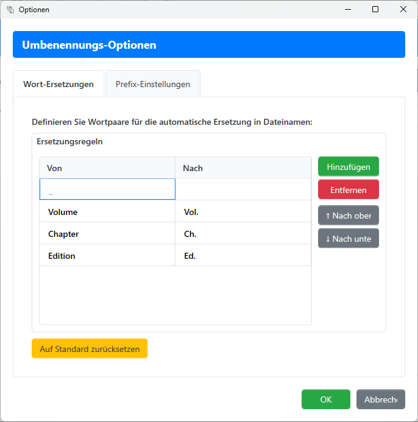
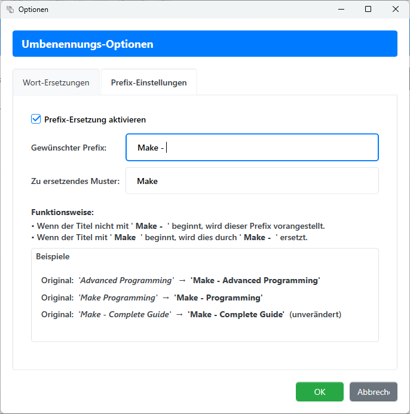

# PDF Rename

Eine moderne WPF-Desktop-Anwendung zum automatischen Umbenennen von PDF-Dateien basierend auf den Metadaten des Dokuments.

## 🤖 KI-gestützte Entwicklung

Diese Anwendung wurde **ausschließlich** durch die Verwendung von **GitHub Copilot** erstellt und wird kontinuierlich damit weiterentwickelt. Das Projekt dient zur Sammlung von Erfahrungen im Umgang mit künstlichen Intelligenzen bei der Softwareerstellung.

**Verwendete KI-Modelle:**
- **GitHub Copilot** (Claude Sonnet 4 basiert) - Für Code-Generierung und -Vervollständigung
- **GitHub Copilot Chat** - Für interaktive Entwicklungsunterstützung und Problemlösung

Dieses Projekt demonstriert die Möglichkeiten moderner KI-Entwicklungstools bei der Erstellung vollständiger, professioneller Softwarelösungen.

## Features

### Moderne Bootstrap-inspirierte Benutzeroberfläche
- **Kopfbereich** mit Anwendungstitel und Statusanzeige
- **Drag & Drop** Unterstützung für PDF-Dateien
- **Responsive Design** das sich an die Fenstergröße anpasst
- **Bootstrap-Styling** für alle UI-Elemente (Buttons, ListView, ComboBox, etc.)

### Drei Betriebsmodi
1. **Automatisch umbenennen**: PDF-Dateien werden sofort beim Hinzufügen umbenannt
2. **Simulations-Modus**: Zeigt die Umbenennungen an, ohne die Dateien tatsächlich zu ändern
3. **Namen vorher bearbeiten**: Ermöglicht die manuelle Bearbeitung der neuen Dateinamen vor dem Umbenennen

### PDF-Metadaten Extraktion
- Verwendet **PdfSharp** (kostenlose Open-Source-Bibliothek)
- Liest den Titel aus den PDF-Metadaten aus
- Wandelt den Titel in einen gültigen Dateinamen um
- Fallback auf den ursprünglichen Dateinamen wenn keine Metadaten vorhanden sind

### Intelligente Dateinamensbereinigung
- Entfernt ungültige Zeichen
- Ersetzt mehrfache Leerzeichen durch Unterstriche
- Begrenzt die Dateinamenlänge
- Stellt sicher, dass der Dateiname nicht leer ist

### Benutzerfreundliche Funktionen
- **Status-Anzeige** für jede Datei (Pending, Processing, Success, Error)
- **Checkboxes** zur Auswahl einzelner Dateien (im Bearbeitungsmodus)
- **Bearbeiten-Button** für jeden Eintrag (im Bearbeitungsmodus)
- **Entfernen-Button** für jeden Eintrag
- **Liste leeren** Funktion
- **Progress-Bar** während der Verarbeitung

### Erweiterte Konfiguration
- **Optionen-Dialog** für erweiterte Einstellungen
- **Wort-Ersetzungen** - Konfigurierbare Liste von Textpaaren für automatische Ersetzungen
- **Präfix-Ersetzungen** - Spezielle Behandlung von Präfixen am Dateianfang
- **Standard-Einstellungen** mit Reset-Funktion

## Screenshots

### Hauptfenster
Das Hauptfenster zeigt die moderne Bootstrap-inspirierte Benutzeroberfläche mit Drag & Drop Funktionalität, Modus-Auswahl und Dateiliste.



### Optionen-Dialog
Der Optionen-Dialog ermöglicht die Konfiguration von Wort-Ersetzungen und Präfix-Behandlung für eine präzise Steuerung der Dateiumbenennung.

**Wort-Ersetzungen Tab:**


**Präfix-Ersetzungen Tab:**


## Technische Details

### Architektur
- **WPF** mit .NET 8.0
- **MVVM-Pattern** mit Microsoft MVVM Toolkit
- **Dependency Injection** für Services
- **Asynchrone Verarbeitung** für bessere Benutzererfahrung

### Dependencies
- **CommunityToolkit.Mvvm** (8.2.2) - Für MVVM-Pattern
- **PdfSharp** (6.0.0) - Für PDF-Metadaten-Extraktion

### Projektstruktur
```
PDFRename/
├── Images/
│   ├── AppIcon.png - Anwendungs-Icon
│   ├── screenshot-main-window.png - Hauptfenster Screenshot
│   ├── screenshot-options-dialog1.png - Optionen Dialog Screenshot 1
│   └── screenshot-options-dialog2.png - Optionen Dialog Screenshot 2
├── Models/
│   ├── Enums.cs - ProcessingMode und FileStatus Enumerationen
│   ├── PdfFileItem.cs - Datenmodell für PDF-Dateien
│   ├── RenameOptions.cs - Konfigurationsmodell für Umbenennungsoptionen
│   └── WordReplacement.cs - Datenmodell für Wort-Ersetzungen
├── Services/
│   ├── PdfMetadataService.cs - PDF-Metadaten-Extraktion
│   └── FileRenameService.cs - Datei-Umbenennungslogik mit Optionen
├── ViewModels/
│   ├── MainViewModel.cs - Haupt-ViewModel mit MVVM Toolkit
│   ├── EditFileNameViewModel.cs - ViewModel für Dateinamens-Bearbeitung
│   └── OptionsViewModel.cs - ViewModel für Optionen-Dialog
├── Views/
│   ├── EditFileNameDialog.xaml/.cs - Dialog zum Bearbeiten von Dateinamen
│   └── OptionsDialog.xaml/.cs - Dialog für erweiterte Optionen
├── Converters/
│   └── ProcessingModeConverter.cs - Converter für Enum-zu-String
├── Styles/
│   └── BootstrapStyles.xaml - Bootstrap-inspirierte UI-Styles
├── MainWindow.xaml/.cs - Hauptfenster
└── App.xaml/.cs - Application-Einstiegspunkt
```

## Installation und Systemanforderungen

### Systemanforderungen
- Windows 10 oder höher (x64)
- **.NET 8.0 Runtime** muss installiert sein
  - Download: https://dotnet.microsoft.com/download/dotnet/8.0
  - Wählen Sie "Download .NET Desktop Runtime 8.0.x"

### Installation
1. Laden Sie die ZIP-Datei von der [Releases-Seite](https://github.com/Smily73/PDF_Rename/releases) herunter
2. Installieren Sie .NET 8.0 Runtime falls noch nicht vorhanden
3. Entpacken Sie die ZIP-Datei in einen beliebigen Ordner
4. Führen Sie `PDFRename.exe` aus

## Verwendung

1. **Anwendung starten**
2. **Modus auswählen** aus der Dropdown-Liste
3. **PDF-Dateien** per Drag & Drop in die Liste ziehen
4. Je nach Modus:
   - **Automatisch**: Dateien werden sofort umbenannt
   - **Simulation**: Vorschau der Umbenennungen ohne tatsächliche Änderungen
   - **Bearbeiten**: Namen können vor dem Umbenennen angepasst werden

## Entwicklung

### Projekt erstellen und ausführen
```bash
dotnet restore
dotnet build
dotnet run
```

### Neue Features hinzufügen
Die Anwendung ist vollständig modular aufgebaut. Neue Features können einfach durch:
- Erweitern der Services
- Hinzufügen neuer ViewModels
- Erstellen zusätzlicher Views
- Anpassen der Styles

## Lizenz

Dieses Projekt steht unter der **MIT-Lizenz**.

### Verwendete Bibliotheken:
- **PdfSharp** (MIT License)
- **CommunityToolkit.Mvvm** (MIT License)

Alle Komponenten sind Open Source und frei verwendbar.
